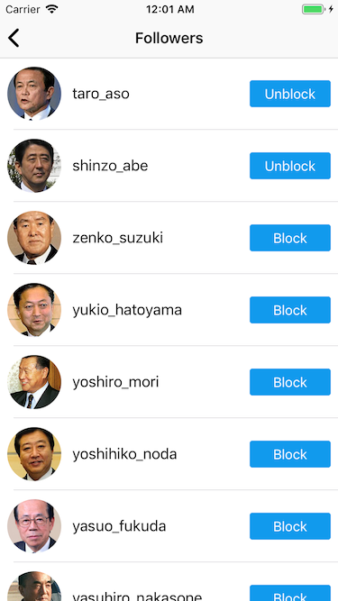
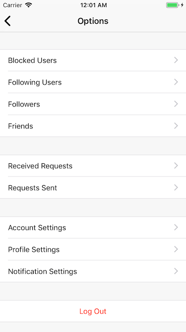

# Cactacea

**Cactacea** is a framework to construct social networking applications and built on top of [Finatra](https://twitter.github.io/finatra/), [Finagle](https://twitter.github.io/finagle/), Twitter Server.

- [`Documents in Japanese`](https://cactacea.github.io/backend/)
- [`API Reference`](https://cactacea.github.io/backend/swagger.html)

#### Demo App Images

